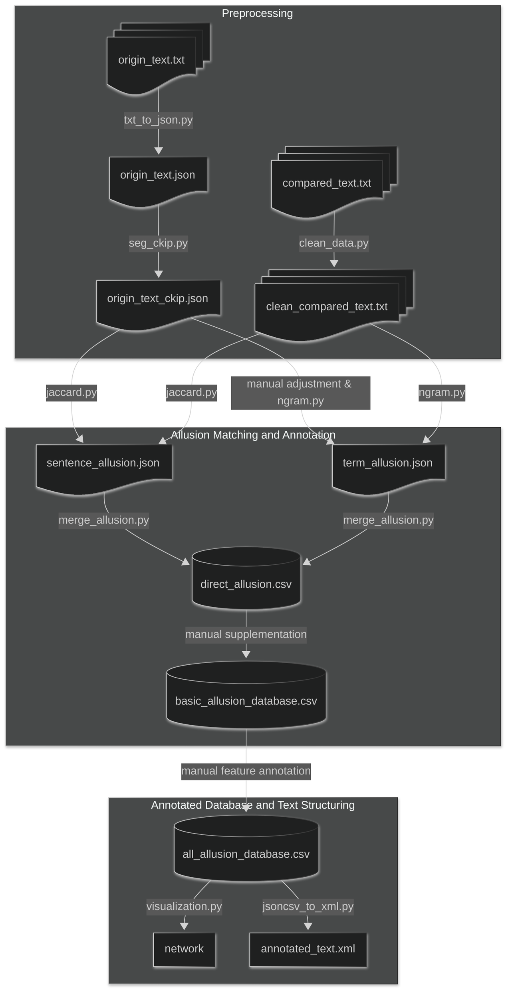

# Workflow

```mermaid
---
config:
  theme: dark
  look: neo
---
flowchart TD
 subgraph Preprocessing["Preprocessing"]
        B1["origin_text.json"]
        A1["origin_text.txt"]
        B2["origin_text_ckip.json"]
        A3["clean_compared_text.txt"]
        A2["compared_text.txt"]
  end
 subgraph subGraph1["Allusion Matching and Annotation"]
        C2["term_allusion.json"]
        C1["sentence_allusion.json"]
        D1[("direct_allusion.csv")]
        E1[("basic_allusion_database.csv")]
  end
 subgraph subGraph2["Annotated Database and Text Structuring"]
        E2[("all_allusion_database.csv")]
        F1["network"]
        F2["annotated_text.xml"]
  end
    A1 -- "txt_to_json.py" --> B1
    B1 -- "seg_ckip.py" --> B2
    A2 -- "clean_data.py" --> A3
    B2 -- "manual adjustment & ngram.py"--> C2
    B2 -- "jaccard.py" --> C1
    A3 -- "jaccard.py" --> C1
    A3 -- "ngram.py" --> C2
    C1 -- "merge_allusion.py" --> D1
    C2 -- "merge_allusion.py" --> D1
    D1 -- manual supplementation --> E1
    E1 -- manual feature annotation --> E2
    E2 -- "visualization.py" --> F1
    E2 -- "jsoncsv_to_xml.py" --> F2
    B1@{ shape: doc}
    A1@{ shape: docs}
    B2@{ shape: doc}
    A3@{ shape: docs}
    A2@{ shape: docs}
    C2@{ shape: doc}
    C1@{ shape: doc}
```
